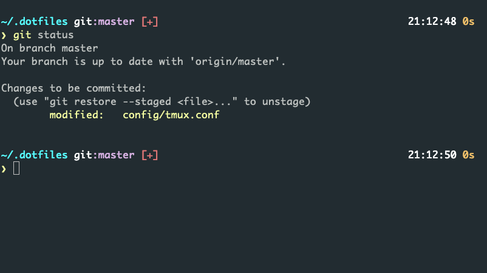

# Yatimisi's dotfiles

> My config files



## Install

**Warning:** If you want to give these dotfiles a try, you should first fork this repository, review the code, and remove things you don't want or need. Don't blindly use my settings unless you know what that entails. Use at your own risk!

### Using git clone dotfiles

You can clone the repository wherever you want.
I like to keep it in `~/.dotfiles`.
```bash
git clone https://github.com/yatimisi/dotfiles && cd dotfiles && sh bootstrap.sh
```

### Not using git install

To install these dotfiles without Git:

```bash
mkdir dotfiles; cd dotfiles; curl -#L https://github.com/yatimisi/dotfiles/tarball/main | tar -xzv --strip-components 1 && sh bootstrap.sh
```

### Run shell to bootstrap

To update, cd into your local dotfiles repository and then:
```bash
sh bootstrap.sh
```

Alternatively, to update while avoiding the confirmation prompt:
```bash
sh bootstrap.sh -f
```

## Feedback
Suggestions/improvements [welcome](https://github.com/yatimisi/dotfiles/issues)!

## Reference and Thanks to:
* https://github.com/arthurc0102/dotfiles
* https://github.com/mathiasbynens/dotfiles
* https://github.com/nanotech/jellybeans.vim
* https://github.com/altercation/vim-colors-solarized
* https://github.com/Larry850806/home
